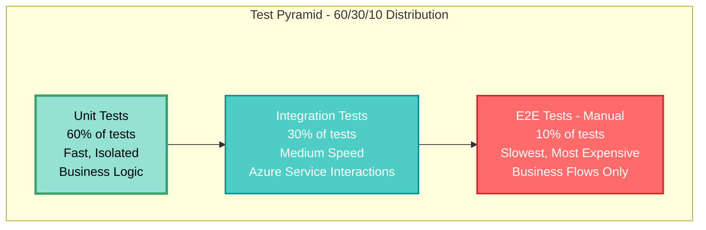
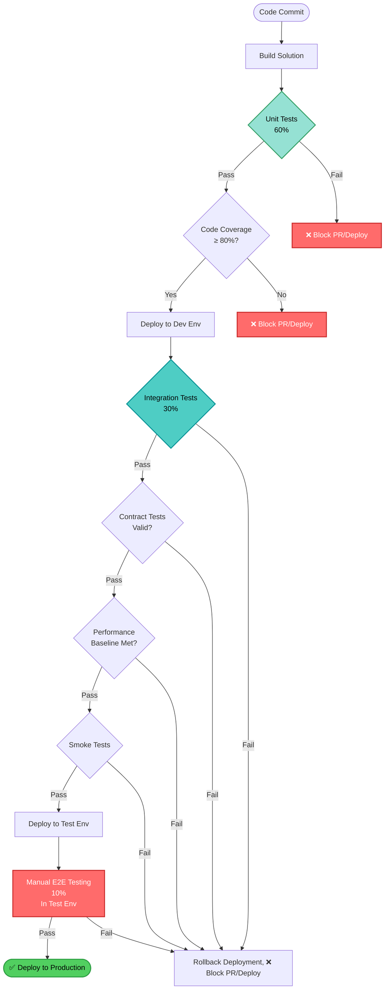
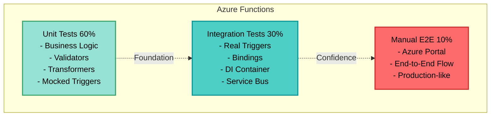
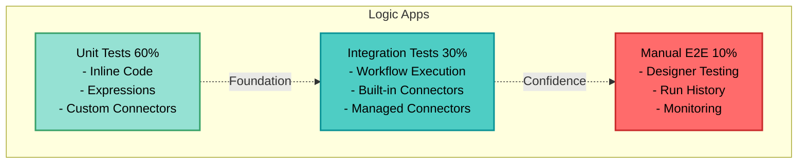
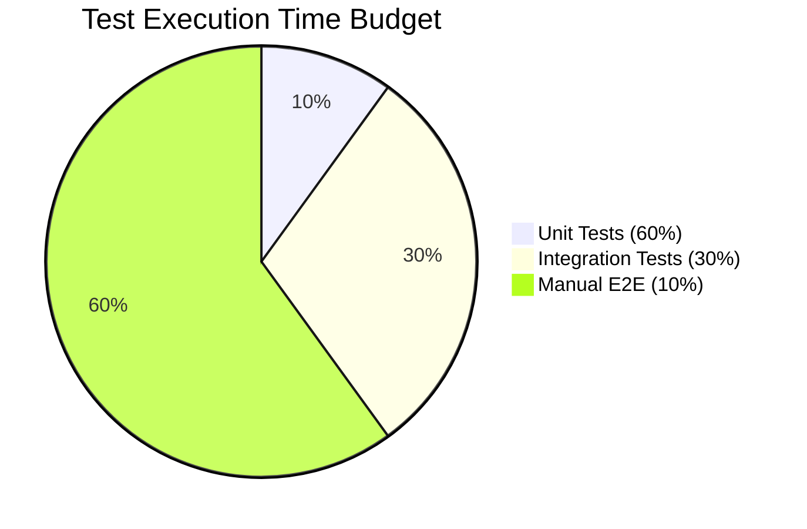
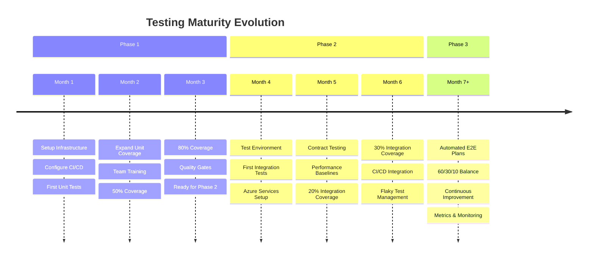
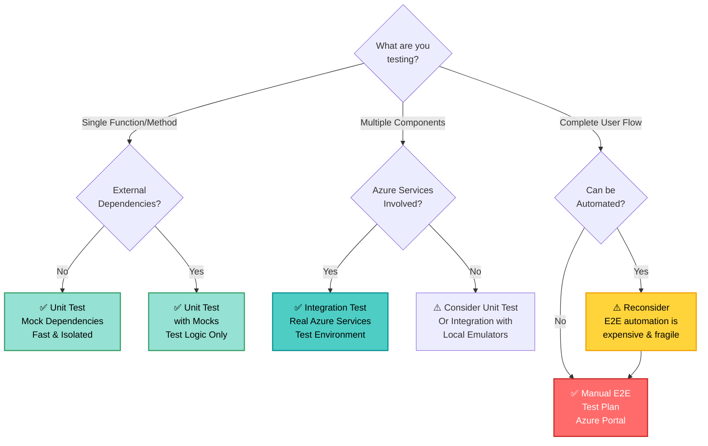

# AUTOMATION_TESTING_STANDARD.md

## Purpose
This file is the single source of truth for automation testing standards across all Azure Integration Platform projects. It defines required practices, test types, tooling, folder structures, CI/CD expectations, and governance rules. All teams and repositories must reference and comply with this standard.

---

## 1. Testing Scope and Test Types

### Step 1 — Unit Testing First (Mandatory Starting Point)
- **Required:**
  - Unit tests for all custom code (Azure Functions, Logic App inline code, helpers, utilities, transformers, validators)
  - Fast, isolated, deterministic tests (< 100ms per test)
  - No external dependencies (mocks/stubs only)
  - Minimum code coverage: 80% for business logic
  - Edge cases, error handling, and validation logic must be covered
- **Intentionally Deferred:**
  - Integration, contract, performance, and system tests
  - End-to-end tests (manual in Azure portal)
  - Any test requiring real Azure resources or infrastructure
  - Tests requiring network calls or database connections

### Step 2 — Integration Testing (Mature Phase)
- **Required:**
  - Integration tests between Azure components (Function → Service Bus, Logic App → API, etc. These can be mocked in test, meaning the actual connections can be tested in portal.)
  - Component interaction validation (triggers, bindings, connectors)
  - Contract tests (API, schema, message format validation using JSON Schema, OpenAPI)
  - Regression tests for critical integration parts
  - Smoke tests for deployment validation
  - Performance tests for key integration scenarios (baseline metrics)
  - Test data setup/teardown automation
- **Intentionally Deferred:**
  - End-to-end tests are performed manually in release/test environments via Azure portal and are not automated
  - Full user journey testing (manual verification)
- **Optional:**
  - Load tests (stress, spike, soak)
  - Resiliency tests (circuit breaker, retry, timeout)
  - Chaos engineering tests
  - Security/penetration tests

---

## 1.5 Test Pyramid Architecture (60-30-10 Distribution)

### Architectural Principle

Our testing strategy follows the **Test Pyramid** pattern, which is a foundational architectural principle for effective and maintainable test automation. The pyramid emphasizes a specific distribution of tests across different levels to optimize speed, cost, coverage, and reliability.

#### The 60-30-10 Distribution

```
                     /\
                    /  \
                   /    \
                  / E2E  \ 10%
                 /_______ \
                /          \
               /Integration \ 30%
              /_____________ \
             /                \
            /   Unit Tests     \ 60%
           /___________________ \
```

**Test Distribution Breakdown:**

| Test Type | Distribution | Quantity (Example) | Execution Time | Scope | Stability |
|-----------|-------------|-------------------|----------------|-------|-----------|
| **Unit Tests** | **60%** | ~600 tests | < 5 min | Single component | Very High (>99%) |
| **Integration Tests** | **30%** | ~300 tests | < 15 min | Component interaction | High (>95%) |
| **E2E/Manual Tests** | **10%** | ~100 tests | Manual/Exploratory | Full user journey | Medium (Manual) |

### Why This Distribution?

**60% Unit Tests (Foundation):**
- **Speed:** Fastest feedback loop (milliseconds per test)
- **Cost:** Cheapest to write and maintain
- **Isolation:** Test one thing at a time, easy to debug
- **Coverage:** High coverage of business logic, edge cases, error handling
- **Reliability:** Most stable (no external dependencies)
- **Developer Experience:** Run locally without infrastructure

**30% Integration Tests (Middle Layer):**
- **Realistic:** Test actual component interactions
- **Confidence:** Validate integration points, contracts, data flow
- **Azure-Specific:** Test real Azure services (Service Bus, Storage, etc.)
- **Balance:** More valuable than E2E, faster than E2E
- **Cost:** Higher cost than unit tests (requires infrastructure, either actual Azure resources or local emulators/containers )
- **Scope:** Mostly ocus on critical integration parts

**10% E2E/Manual Tests (Top):**
- **Business Value:** Validate complete user journeys
- **Exploratory:** Manual testing for usability, edge cases
- **Expensive:** Slowest, most fragile, hardest to maintain
- **Strategic:** Only for critical business flows
- **Execution:** Performed manually in release/test environments via Azure portal
- **Not Automated:** E2E tests are intentionally kept manual to reduce maintenance burden

### Architectural Implications

#### 1. Test Design Decisions

**DO:**
- ✅ Write many small, focused unit tests for all business logic
- ✅ Test error paths, edge cases, validation in unit tests
- ✅ Write integration tests for all Azure service interactions
- ✅ Automate unit and integration (as much as possible) tests in CI/CD
- ✅ Perform E2E tests manually in dedicated test environments

**DON'T:**
- ❌ Skip unit tests because you have integration tests
- ❌ Test business logic only in integration tests
- ❌ Write integration tests for things that can be unit tested
- ❌ Automate E2E tests (keep them manual and exploratory)

#### 2. Effort Distribution

When creating tests for a new feature:

| Activity | Time Investment |
|----------|----------------|
| Unit Test Design & Implementation | 40-50% |
| Integration Test Design & Implementation | 30-40% |
| Manual E2E Test Planning & Execution | 10-20% |

#### 3. Team Skills and Responsibilities

| Role | Primary Focus | Test Types |
|------|--------------|------------|
| **Developers** | Write tests with code | Unit (60%) + Integration (30%) |
| **QA Engineers (?, Developers?)** | Test strategy, quality gates | Integration (30%) + E2E (10%) |
| **DevOps Engineers (?, Developers?)** | Pipeline automation, infrastructure | Integration test environments |

### Measuring Compliance with 60-30-10

**Tracking Test Distribution:**

```csharp
// Example metrics collection
Total Unit Tests: 582 (62%)
Total Integration Tests: 276 (29%)
Total E2E Tests (Manual): 85 (9%)
Total Tests: 943

Status: ✅ Compliant with 60-30-10 pyramid
```

### Anti-Patterns to Avoid

| Anti-Pattern | Problem | Solution |
|--------------|---------|----------|
| **Inverted Pyramid** | More E2E than unit tests | Refactor: move logic tests to unit level |
| **Ice Cream Cone** | Mostly manual tests | Automate: add unit & integration tests |
| **Hourglass** | Missing integration tests | Add: integration tests for service boundaries |
| **100% Unit Tests** | No integration confidence | Add: integration tests for critical parts |

### Phase-Based Evolution

**Phase 1: Build the Foundation (60% Unit Tests)**
Integration tests and E2E tests will be done manually.
- Focus: Establish unit testing culture
- Target: 60% of all tests are unit tests
- Duration: 2-3 months
- Exit Criteria: Stable unit test suite, 80% code coverage

**Phase 2: Add Integration Layer (30% Integration Tests)**
E2E tests will be done manually.
- Focus: Test Azure service interactions
- Target: 30% of all tests are integration tests
- Duration: 3-6 months
- Exit Criteria: All integration points tested, contracts validated

**Phase 3, someday: Automated E2E tests (10% E2E Tests)**
All tests should will be automated.
- Focus: Automated testing of critical flows
- Target: 10% effort on automated E2E testing
- Duration: From the date forward
- Exit Criteria: Test plans for all critical business flows

### Benefits of 60-30-10 Distribution

1. **Fast Feedback:** Most tests (60%) run in seconds
2. **High Confidence:** Integration tests (30%) validate real scenarios
3. **Cost Effective:** Minimize expensive E2E tests (10%)
4. **Maintainable:** Unit tests are easy to update
5. **Scalable:** Can add tests without slowing down pipeline
6. **Clear Responsibility:** Each layer has distinct purpose

---

## 1.6 Visual Guides and Architecture Diagrams

### Test Pyramid Architecture



### Testing Strategy by Phase

```mermaid
graph LR
    subgraph Phase 1: Foundation - 2-3 months
    P1[Unit Tests Only<br/>60% Coverage<br/>Fast Feedback<br/>Low Cost]
    end

    subgraph Phase 2: Maturity - 3-6 months
    P2[Unit + Integration<br/>90% Total Coverage<br/>Azure Services<br/>Contract Testing]
    end

    subgraph Phase 3: Continuous
    P3[Complete Strategy<br/>60/30/10 Distribution<br/>Automated E2E<br/>Full Automation]
    end

    P1 -->|Exit Criteria Met| P2
    P2 -->|Fully Adopted| P3

    style P1 fill:#000000,stroke:#1976d2,stroke-width:2px
    style P2 fill:#000000,stroke:#7b1fa2,stroke-width:2px
    style P3 fill:#000000,stroke:#388e3c,stroke-width:2px
```



### CI/CD Pipeline Flow with Test Gates



### Azure Service Testing Strategy




### Test Execution Time Distribution



### Testing Maturity Journey



### Test Type Decision Tree



---

## 2. Azure-Specific Testing Strategies

| Service                | Unit Testable in Step 1 | Integration Test in Step 2 |
|------------------------|------------------------|--------------------------|
| Azure Functions        | All code, business logics | Bindings, services, integration |
| Logic Apps             | Inline code, expressions | Workflow, connectors, triggers |
| Data Factory           | TBD (*Custom activities (mocked)*) | TBD (*Pipeline runs, data movement*) |

- **Async/retries/failures:**
  - Step 1: Simulate with mocks (verify retry logic, timeout handling, error propagation)
  - Step 2: Test with real infra (transient failures, poison messages, dead-letter queues)

**Testing Approach by Component Type:**

**Azure Functions:**
- Step 1: Test business logic, input validation, output formatting (mocked triggers/bindings)
- Step 2: Test real triggers (HTTP, Timer, Queue, Event Grid), bindings (CosmosDB, Blob, Table), and dependency injection

**Logic Apps Standard:**
- Step 1: Test inline JavaScript/C# code, expressions
- Step 2: Test workflow execution, built-in connectors, managed connectors, triggers

---

## 3. Tooling and Frameworks

### Step 1 (Unit Testing)
- **Azure Functions (.NET):** xUnit
- **Mocking/Stubbing:** Moq
- **Assertions:** FluentAssertions
- **Test Data:** AutoFixture
- **Logic Apps Inline Code:** Jest
- **Code Coverage:** **TBD** (Coverlet (.NET), Istanbul/nyc (JavaScript))
- **CI:** GitHub Actions, Azure Pipelines
- **Local Execution:** dotnet test, npm test

### Step 2 (Integration Testing)
- **Azure-native:** 
  - Azurite (Storage Emulator)
  - Logic Apps Standard local runtime
  - Azure Functions Core Tools (local runtime)
  - Azure CLI (resource provisioning/cleanup)
- **Open-source:** 
  - Postman/Newman (API contract testing)
  - WireMock (HTTP service mocking)
  - TestContainers (infrastructure dependencies)
  - SpecFlow/Cucumber (BDD-style integration tests)
  - REST Assured (API testing)
- **Azure SDK for Testing:**
  - Azure.Messaging.ServiceBus (integration tests)
  - Azure.Storage.Blobs (integration tests)
  - Microsoft.Azure.WebJobs.Extensions.* (binding validation)
- **Performance/Load:**
  - Azure Load Testing
  - k6, JMeter, Gatling (open-source alternatives)
- **Contract Testing:**
  - Pact (consumer-driven contracts)
  - JSON Schema validators
  - OpenAPI/Swagger validators

---

## 4. CI/CD and Automation

### Step 1 — Unit Testing Pipeline
- **Trigger:** Every PR and commit to main/develop branches
- **Execution:** < 5 minutes total
- **Quality Gates:**
  - All unit tests must pass (0 failures)
  - Minimum code coverage: 80% (configurable per project)
  - No critical/high security vulnerabilities
  - Build must succeed
- **Reporting:**
  - Publish test results to pipeline
  - Publish code coverage report
  - Block PR merge if quality gates fail
- **Artifacts:**
  - Code coverage reports
  - Test result files (TRX, JUnit XML)

### Step 2 — Integration Testing Pipeline
- **Trigger:** Post-deployment to dev/test environments
- **Prerequisites:** Unit tests passed, deployment successful
- **Execution:** < 15 minutes total
- **Environment:** Dedicated test environment (isolated from production)
- **Quality Gates:**
  - All integration tests must pass
  - Performance baseline not degraded (< 10% regression)
  - Contract tests validate API/message schemas
  - Smoke tests verify critical paths
- **Test Isolation:**
  - Each test run uses unique test data
  - Cleanup after test execution (delete test resources)
  - No shared state between tests
- **Flaky Test Handling:**
  - Retry flaky tests up to 2 times
  - Track flaky test metrics
  - Mark consistently flaky tests as quarantined (don't block pipeline)
  - Weekly review of flaky tests
- **Promotion:**
  - Deploy to next environment only if all gates pass
  - Manual approval for production deployment

---

## 5. Standardization and Reusability

### Naming Conventions
- **Test Projects:** 
  - Unit: `<Component>.UnitTests` (e.g., `OrderProcessor.UnitTests`)
  - Integration: `<Component>.IntegrationTests`
- **Test Files:** 
  - C#: `<Target>Tests.cs` (e.g., `OrderServiceTests.cs`)
  - JavaScript/TypeScript: `<target>.test.js` or `<target>.spec.js`
- **Test Methods/Functions:**
  - Pattern: `<MethodName>_<Scenario>_<ExpectedResult>`
  - Example: `ProcessOrder_WithInvalidData_ThrowsValidationException`
  - Alternative (BDD): `Given_When_Then` pattern

### Folder Structure
```
/project-root
  /src
    /FunctionApp1
      /Functions
      /Services
      /Models
    /LogicApp1
      /workflow.json
      /lib
  /tests
    /unit
      /FunctionApp1.UnitTests
        /Functions
        /Services
        /Models
      /LogicApp1.UnitTests
        /lib
    /integration
      /FunctionApp1.IntegrationTests
        /Scenarios
        /Fixtures
      /LogicApp1.IntegrationTests
    /shared
      /TestUtilities
        /Builders
        /Fixtures
        /Helpers
  /pipelines
    /ci-unit-tests.yml
    /ci-integration-tests.yml
```

### Shared Libraries
- **Location:** `/tests/shared/TestUtilities`
- **Purpose:**
  - Test data builders (Builder pattern)
  - Common assertions
  - Mock factories
  - Test fixtures
  - Helper methods
- **Versioning:** Shared utilities should be versioned and published as internal NuGet/npm packages for multi-repo scenarios

### Test Data Management
- **Unit Tests:** Use in-memory test data builders (AutoFixture, Bogus)
- **Integration Tests:** 
  - Use dedicated test data files (`/tests/integration/TestData`)
  - JSON files for message payloads
  - SQL scripts for database setup
  - Terraform/Bicep for infrastructure setup

### Code Reusability
- Create base test classes for common setup/teardown
- Use test fixtures for shared context
- Implement custom assertions for domain-specific validation
- Share mock configurations across similar tests

---

## 6. Governance and Best Practices

### Definition of Done
**Step 1 (Unit Testing):**
- [ ] All new/modified code has corresponding unit tests
- [ ] Unit tests pass locally and in CI pipeline
- [ ] Code coverage ≥ 80% for business logic
- [ ] No skipped or ignored tests without justification
- [ ] Test code reviewed as part of PR
- [ ] All edge cases and error paths tested

**Step 2 (Integration Testing):**
- [ ] All integration points have integration tests
- [ ] Contract tests validate API/message schemas
- [ ] Integration tests pass in test environment
- [ ] Performance baselines established and met
- [ ] Test data cleanup automated
- [ ] No manual intervention required

### Minimum Expectations
- **PR Requirements:**
  - No PR merges without passing tests
  - Test code must be reviewed with same rigor as production code
  - Test coverage must not decrease
  - New features require new tests
  - Bug fixes require regression tests
- **Code Review Checklist:**
  - [ ] Tests are readable and maintainable
  - [ ] Tests follow naming conventions
  - [ ] Tests are isolated (no dependencies between tests)
  - [ ] Tests use appropriate assertions
  - [ ] Mocks are used appropriately (not over-mocked)
  - [ ] Test data is clear and meaningful

### Environment Isolation
- **Integration Test Environments:**
  - Dedicated test subscriptions/resource groups
  - No shared resources with production
  - Network isolation where applicable
  - Separate identity/credentials
- **Test Data Isolation:**
  - Use unique identifiers/timestamps for test data
  - Automated cleanup after test runs
  - No production data in test environments

### Security and Compliance
- **Secret Management:**
  - No hardcoded secrets/credentials in test code
  - Use Azure Key Vault for integration test secrets
  - Use pipeline variables/service connections in CI/CD
  - Rotate test credentials regularly
- **Test Data:**
  - No PII or sensitive production data
  - Use synthetic/anonymized data only
  - Follow data residency requirements
  - Comply with GDPR/data protection regulations

### Observability and Monitoring
- **Test Metrics:**
  - Track test execution time trends
  - Monitor test pass/fail rates
  - Track code coverage trends
  - Identify flaky tests
- **Logging:**
  - Log test failures with detailed context
  - Include correlation IDs for integration tests
  - Store test logs for troubleshooting
- **Alerting:**
  - Alert on consistent test failures
  - Alert on significant coverage drops
  - Weekly reports on test health

### Test Maintenance
- **Regular Reviews:**
  - Quarterly review of test suite health
  - Remove obsolete tests
  - Refactor duplicated test code
  - Update tests for deprecated features
- **Performance:**
  - Keep unit tests fast (< 100ms each)
  - Optimize slow integration tests
  - Parallelize test execution where possible
  - Monitor total pipeline execution time

---

## 6.5 Test Metrics and Key Performance Indicators (KPIs)

### Purpose
Metrics provide objective measurement of testing effectiveness, quality trends, and maturity progress. Teams must track and report these KPIs to ensure continuous improvement and compliance with the testing standard.

### Core Metrics

#### 1. Test Distribution Metrics (60-30-10 Pyramid)

**Primary KPI: Test Pyramid Ratio**

| Metric | Calculation | Target | Status Interpretation |
|--------|------------|--------|----------------------|
| **Unit Test %** | (Unit Tests / Total Tests) × 100 | 55-70% (Target: 60%) | 🟢 Compliant if within range<br/>🟡 Warning if 50-54% or 71-75%<br/>🔴 Non-compliant if < 50% or > 75% |
| **Integration Test %** | (Integration Tests / Total Tests) × 100 | 25-35% (Target: 30%) | 🟢 Compliant if within range<br/>🟡 Warning if 20-24% or 36-40%<br/>🔴 Non-compliant if < 20% or > 40% |
| **E2E Test %** | (E2E Tests / Total Tests) × 100 | 5-15% (Target: 10%) | 🟢 Compliant if within range<br/>🟡 Warning if < 5% or > 15%<br/>🔴 Non-compliant if > 20% |

**Example Calculation:**
```
Project: OrderProcessing
- Unit Tests: 582
- Integration Tests: 276
- E2E Tests (Manual): 85
- Total Tests: 943

Unit %:        582/943 = 61.7% ✅ (Target: 60%)
Integration %: 276/943 = 29.3% ✅ (Target: 30%)
E2E %:         85/943  = 9.0%  ✅ (Target: 10%)

Status: ✅ Compliant with 60-30-10 pyramid
```

**Tracking Code (PowerShell):**
```powershell
# Calculate test distribution
$unitTests = (dotnet test --filter "Category=Unit" --list-tests | Measure-Object).Count
$integrationTests = (dotnet test --filter "Category=Integration" --list-tests | Measure-Object).Count
$e2eTests = 85 # Manual tests from test plan

$total = $unitTests + $integrationTests + $e2eTests

$unitPercent = [math]::Round(($unitTests / $total) * 100, 1)
$intPercent = [math]::Round(($integrationTests / $total) * 100, 1)
$e2ePercent = [math]::Round(($e2eTests / $total) * 100, 1)

Write-Host "Test Pyramid Distribution:"
Write-Host "Unit:        $unitTests ($unitPercent%) - Target: 60%"
Write-Host "Integration: $integrationTests ($intPercent%) - Target: 30%"
Write-Host "E2E:         $e2eTests ($e2ePercent%) - Target: 10%"

# Validate compliance
$compliant = ($unitPercent -ge 55 -and $unitPercent -le 70) -and
             ($intPercent -ge 25 -and $intPercent -le 35) -and
             ($e2ePercent -ge 5 -and $e2ePercent -le 15)

if ($compliant) {
    Write-Host "✅ Compliant with 60-30-10 pyramid" -ForegroundColor Green
} else {
    Write-Host "❌ Non-compliant with test pyramid" -ForegroundColor Red
}
```

#### 2. Code Coverage Metrics

| Metric | Target | Minimum Acceptable | Critical Threshold |
|--------|--------|-------------------|-------------------|
| **Overall Code Coverage** | ≥ 80% | ≥ 70% | < 60% (Blocker) |
| **Business Logic Coverage** | ≥ 90% | ≥ 80% | < 70% (Blocker) |
| **Branch Coverage** | ≥ 75% | ≥ 65% | < 55% |
| **New Code Coverage** | 100% | ≥ 90% | < 80% (Blocker) |

**Coverage Trends:**
- Track coverage weekly
- Report coverage delta on each PR
- Prevent coverage regression (no decrease > 2%)

#### 3. Test Execution Metrics

| Metric | Phase 1 Target | Phase 2 Target | Measurement |
|--------|---------------|---------------|-------------|
| **Unit Test Execution Time** | < 5 minutes | < 5 minutes | Total time for all unit tests |
| **Integration Test Execution Time** | N/A (Phase 2) | < 15 minutes | Total time for all integration tests |
| **Total Pipeline Time** | < 8 minutes | < 25 minutes | End-to-end CI/CD execution |
| **Average Unit Test Duration** | < 100ms | < 100ms | Mean time per unit test |
| **Average Integration Test Duration** | N/A | < 3 seconds | Mean time per integration test |

**Performance Monitoring:**
```yaml
# Azure Pipeline task to monitor test execution time
- task: PowerShell@2
  displayName: 'Monitor Test Performance'
  inputs:
    targetType: 'inline'
    script: |
      $testDuration = $(Build.TestRunDuration)
      $threshold = 300 # 5 minutes in seconds
      
      if ($testDuration -gt $threshold) {
        Write-Warning "⚠️ Test execution time ($testDuration s) exceeds threshold ($threshold s)"
        Write-Host "##vso[task.logissue type=warning]Tests are too slow"
      } else {
        Write-Host "✅ Test performance acceptable ($testDuration s)"
      }
```

#### 4. Test Quality Metrics

| Metric | Target | Action Required If |
|--------|--------|-------------------|
| **Flaky Test Rate** | < 2% | > 5% - Immediate investigation<br/>> 10% - Block deployments |
| **Test Pass Rate** | 100% | < 100% - Fix immediately |
| **Skipped/Ignored Tests** | 0 | > 0 - Require justification |
| **Test Maintainability Index** | > 80 | < 60 - Refactor tests |

**Flaky Test Detection:**
```csharp
// Run tests multiple times to detect flakiness
dotnet test --logger "trx" -- RunConfiguration.MaxCpuCount=1

// Analyze results for inconsistency
// Flag tests that fail intermittently
```

#### 5. Defect Metrics

| Metric | Target | Formula |
|--------|--------|---------|
| **Defect Escape Rate** | < 5% | (Production Bugs / Total Bugs Found) × 100 |
| **Bug Detection in Testing** | > 80% | (Bugs Found in Testing / Total Bugs) × 100 |
| **Critical Bugs in Production** | 0 per release | Count of severity-1 bugs |
| **Test-Prevented Defects** | Track & Report | Bugs caught by tests before production |

**Defect Tracking:**
- Tag bugs with detection phase (unit-test, integration-test, production)
- Analyze root cause for escaped defects
- Add regression tests for all production bugs

#### 6. Maturity Metrics

| Phase | Maturity Score | Calculation |
|-------|---------------|-------------|
| **Phase 1** | 0-100 | Based on [MATURITY_ASSESSMENT.md](MATURITY_ASSESSMENT.md) checklist |
| **Phase 2** | 0-100 | Based on [MATURITY_ASSESSMENT.md](MATURITY_ASSESSMENT.md) checklist |
| **Overall Maturity** | 0-100 | Weighted average of all phases |

**Maturity Levels:**
- 🔴 **0-49%:** Not Compliant - Immediate action required
- 🟡 **50-74%:** Partially Compliant - Improvement plan needed
- 🟢 **75-89%:** Mostly Compliant - Minor gaps
- ✅ **90-100%:** Fully Compliant - Maintain and improve

### Reporting and Dashboards

#### 1. Daily Metrics (Automated)
- Test pass/fail rate
- Test execution time
- Code coverage (per PR)
- Pipeline success rate

#### 2. Weekly Metrics (Team Review)
- Test distribution (60-30-10)
- Flaky test trends
- Coverage trends
- Test performance trends

#### 3. Monthly Metrics (Leadership Review)
- Maturity score
- Defect escape rate
- Testing ROI (bugs prevented vs. found in production)
- Team productivity impact

#### 4. Quarterly Metrics (Strategic Review)
- Testing strategy effectiveness
- Phase transition readiness
- Compliance audit results
- Industry benchmark comparison

### Dashboard Example (Azure DevOps)

```yaml
# widgets.json - Azure DevOps dashboard configuration
{
  "widgets": [
    {
      "name": "Test Results Trend",
      "type": "Microsoft.VisualStudioOnline.Dashboards.TestResultsTrendWidget",
      "settings": {
        "pipelineId": "*",
        "resultTypes": ["Passed", "Failed", "NotExecuted"]
      }
    },
    {
      "name": "Code Coverage",
      "type": "Microsoft.VisualStudioOnline.Dashboards.CodeCoverageWidget",
      "settings": {
        "threshold": 80
      }
    },
    {
      "name": "Test Distribution",
      "type": "Custom.TestPyramidWidget",
      "settings": {
        "unitTarget": 60,
        "integrationTarget": 30,
        "e2eTarget": 10
      }
    }
  ]
}
```

### Metrics Automation

**PowerShell Script for Test Metrics Collection:**

```powershell
# collect-test-metrics.ps1
param(
    [string]$TestResultsPath = "./TestResults"
)

# Parse test results
$unitTestResults = Get-ChildItem -Path $TestResultsPath -Filter "*unit*.trx" -Recurse
$integrationTestResults = Get-ChildItem -Path $TestResultsPath -Filter "*integration*.trx" -Recurse

# Calculate metrics
$metrics = @{
    TotalTests = 0
    UnitTests = 0
    IntegrationTests = 0
    PassedTests = 0
    FailedTests = 0
    SkippedTests = 0
    TotalDuration = 0
    CodeCoverage = 0
    Timestamp = (Get-Date).ToString("yyyy-MM-dd HH:mm:ss")
}

# Process unit tests
foreach ($result in $unitTestResults) {
    [xml]$content = Get-Content $result.FullName
    $counters = $content.TestRun.ResultSummary.Counters
    
    $metrics.UnitTests += [int]$counters.total
    $metrics.PassedTests += [int]$counters.passed
    $metrics.FailedTests += [int]$counters.failed
    $metrics.SkippedTests += [int]$counters.notExecuted
}

# Process integration tests
foreach ($result in $integrationTestResults) {
    [xml]$content = Get-Content $result.FullName
    $counters = $content.TestRun.ResultSummary.Counters
    
    $metrics.IntegrationTests += [int]$counters.total
    $metrics.PassedTests += [int]$counters.passed
    $metrics.FailedTests += [int]$counters.failed
}

$metrics.TotalTests = $metrics.UnitTests + $metrics.IntegrationTests

# Calculate pyramid distribution
$unitPercent = [math]::Round(($metrics.UnitTests / $metrics.TotalTests) * 100, 1)
$intPercent = [math]::Round(($metrics.IntegrationTests / $metrics.TotalTests) * 100, 1)

# Output JSON for dashboard
$output = @{
    Metrics = $metrics
    Pyramid = @{
        Unit = $unitPercent
        Integration = $intPercent
        UnitTarget = 60
        IntegrationTarget = 30
    }
    Compliance = @{
        PyramidCompliant = ($unitPercent -ge 55 -and $unitPercent -le 70 -and $intPercent -ge 25 -and $intPercent -le 35)
        CoverageCompliant = $metrics.CodeCoverage -ge 80
        AllTestsPassing = $metrics.FailedTests -eq 0
    }
}

$output | ConvertTo-Json -Depth 5 | Out-File -FilePath "./test-metrics.json"

Write-Host "✅ Metrics collected and saved to test-metrics.json"
Write-Host "Test Pyramid: Unit=$unitPercent%, Integration=$intPercent%"
```

### Action Thresholds

| Condition | Action Required | Owner | Timeline |
|-----------|----------------|-------|----------|
| Code coverage < 60% | Block PR, don't merge | Developer | Immediate |
| Code coverage 60-79% | Add tests before merge | Developer | Within PR cycle |
| Flaky test rate > 10% | Quarantine tests, investigate | QA Lead | Within 1 week |
| Test pyramid off by > 20% | Review test strategy | Tech Lead | Within sprint |
| Test execution > 10 min (unit) | Optimize or parallelize tests | DevOps | Within 2 weeks |
| Defect escape rate > 10% | Review testing gaps | Team | Next retrospective |
| 0 new tests for 2 sprints | Review DoD enforcement | Scrum Master | Immediate |

### Continuous Improvement

**Monthly Review Questions:**
1. Are we maintaining 60-30-10 distribution?
2. Is code coverage stable or improving?
3. Are tests fast enough (< 5 min unit, < 15 min integration)?
4. Are there patterns in escaped defects?
5. Are flaky tests being addressed?
6. Is test maintenance burden increasing?

**Quarterly Goals:**
- Reduce flaky test rate by 50%
- Improve test execution time by 20%
- Increase coverage by 5%
- Reduce defect escape rate by 25%

---

## 7. Maturity Roadmap

### Phase 1: Unit Testing Foundation (Mandatory)
**Duration:** 2-3 months for initial adoption

**Entry Criteria:**
- Team commitment to testing culture
- Basic CI/CD pipeline in place
- Development environment setup complete

**Success Criteria:**
- ✅ All new code has unit tests (100% compliance for 1 month)
- ✅ Unit test pipeline runs on every PR
- ✅ Code coverage ≥ 80% for new code
- ✅ Average test execution time < 5 minutes
- ✅ Zero critical bugs escaped to production from untested code
- ✅ Team comfortable writing and maintaining tests

**Exit Criteria (Ready for Phase 2):**
- [ ] 100% of active projects have unit tests
- [ ] Unit test coverage ≥ 80% across codebase
- [ ] Pipeline reliability ≥ 95% (few flaky tests)
- [ ] Team has established testing patterns/practices
- [ ] No significant defects in production from untested code for 2 months

---

### Phase 2: Integration Testing (Mature Phase)
**Duration:** 3-6 months for full adoption

**Entry Criteria:**
- Phase 1 exit criteria met
- Test environment infrastructure available
- Team has capacity to write integration tests

**Success Criteria:**
- ✅ All integration points have integration tests
- ✅ Contract tests cover all API/message interfaces
- ✅ Integration tests run post-deployment
- ✅ Test data management automated
- ✅ Performance baselines established
- ✅ < 5% flaky test rate

**Exit Criteria (Ready for Phase 3):**
- [ ] Integration tests cover all critical paths
- [ ] Contract tests prevent breaking changes
- [ ] Integration test execution time < 15 minutes
- [ ] Automated test data setup/teardown
- [ ] No integration defects in production for 3 months

---

### Phase 3: Advanced Testing (Optional)
**Focus:** Performance, chaos, security, resilience

**Entry Criteria:**
- Phase 2 exit criteria met
- Business case for advanced testing
- Specialized tooling/infrastructure available

**Success Criteria:**
- ✅ Performance benchmarks defined and tested
- ✅ Load tests validate scalability
- ✅ Chaos tests verify resilience
- ✅ Security tests integrated in pipeline

---

### Common Pitfalls and How to Avoid Them

| Pitfall | Impact | Solution |
|---------|--------|----------|
| Skipping unit tests for speed | Technical debt, production bugs | Enforce pipeline gates, make testing part of DoD |
| Over-mocking (testing mocks, not code) | False confidence | Review test quality, balance mocks with real dependencies |
| Flaky integration tests | Pipeline unreliability, lost trust | Isolate test data, implement retry logic, monitor trends |
| Slow test suites | Reduced productivity | Parallelize, optimize, remove redundant tests |
| Not cleaning up test data | Resource bloat, cost | Automate cleanup, use TTL/expiration |
| Hardcoded test data | Brittle tests | Use test builders, randomize data |
| Ignoring test failures | Degraded quality | Zero-tolerance policy, investigate immediately |
| No test maintenance | Obsolete, failing tests | Regular reviews, refactor with production code |

---

### Readiness Checklist

**Phase 1 → Phase 2 Readiness Assessment:**

**Technical Readiness:**
- [ ] Test environment provisioned and accessible
- [ ] Azure resources available for integration tests
- [ ] Test data strategy defined
- [ ] Integration test tooling selected and configured
- [ ] CI/CD pipeline supports post-deployment testing

**Team Readiness:**
- [ ] Team trained on integration testing practices
- [ ] Team has written sample integration tests
- [ ] Testing champions identified in each team
- [ ] Documentation and examples available

**Process Readiness:**
- [ ] Integration test standards documented
- [ ] Definition of Done updated
- [ ] Code review guidelines include integration tests
- [ ] Test data management process defined

**Quality Metrics:**
- [ ] Unit test coverage ≥ 80% for 2 months
- [ ] < 2% flaky unit tests
- [ ] No escaped defects from untested code
- [ ] Pipeline execution time acceptable (< 5 min)

## 8. Examples and Templates

### 8.1 Example Test Cases

#### Azure Function - Unit Test Example (C#)

```csharp
// OrderProcessor.UnitTests/Functions/ProcessOrderTests.cs
using Xunit;
using Moq;
using FluentAssertions;
using OrderProcessor.Functions;
using OrderProcessor.Services;
using OrderProcessor.Models;

namespace OrderProcessor.UnitTests.Functions
{
    public class ProcessOrderTests
    {
        private readonly Mock<IOrderService> _orderServiceMock;
        private readonly ProcessOrderFunction _function;

        public ProcessOrderTests()
        {
            _orderServiceMock = new Mock<IOrderService>();
            _function = new ProcessOrderFunction(_orderServiceMock.Object);
        }

        [Fact]
        public async Task ProcessOrder_WithValidOrder_ReturnsSuccess()
        {
            // Arrange
            var order = new Order 
            { 
                Id = "123", 
                CustomerId = "C456", 
                Amount = 100.50m 
            };
            
            _orderServiceMock
                .Setup(s => s.ValidateOrder(It.IsAny<Order>()))
                .ReturnsAsync(true);
            
            _orderServiceMock
                .Setup(s => s.ProcessOrder(It.IsAny<Order>()))
                .ReturnsAsync(new ProcessResult { Success = true });

            // Act
            var result = await _function.Run(order);

            // Assert
            result.Success.Should().BeTrue();
            _orderServiceMock.Verify(s => s.ValidateOrder(order), Times.Once);
            _orderServiceMock.Verify(s => s.ProcessOrder(order), Times.Once);
        }

        [Fact]
        public async Task ProcessOrder_WithInvalidOrder_ThrowsValidationException()
        {
            // Arrange
            var order = new Order { Id = null }; // Invalid order
            
            _orderServiceMock
                .Setup(s => s.ValidateOrder(It.IsAny<Order>()))
                .ReturnsAsync(false);

            // Act & Assert
            await Assert.ThrowsAsync<ValidationException>(
                () => _function.Run(order)
            );
            
            _orderServiceMock.Verify(s => s.ProcessOrder(It.IsAny<Order>()), Times.Never);
        }

        [Theory]
        [InlineData(0)]
        [InlineData(-10)]
        public async Task ProcessOrder_WithInvalidAmount_ThrowsException(decimal amount)
        {
            // Arrange
            var order = new Order { Id = "123", Amount = amount };

            // Act & Assert
            await Assert.ThrowsAsync<ArgumentException>(
                () => _function.Run(order)
            );
        }
    }
}
```

#### Azure Function - Integration Test Example (C#)

```csharp
// OrderProcessor.IntegrationTests/Scenarios/OrderProcessingTests.cs
using Xunit;
using Azure.Messaging.ServiceBus;
using Microsoft.Extensions.Configuration;
using FluentAssertions;

namespace OrderProcessor.IntegrationTests.Scenarios
{
    [Collection("IntegrationTests")]
    public class OrderProcessingTests : IAsyncLifetime
    {
        private ServiceBusClient _serviceBusClient;
        private ServiceBusSender _sender;
        private ServiceBusReceiver _receiver;
        private readonly IConfiguration _configuration;
        private readonly string _testRunId;

        public OrderProcessingTests()
        {
            _configuration = new ConfigurationBuilder()
                .AddJsonFile("appsettings.test.json")
                .Build();
            
            _testRunId = Guid.NewGuid().ToString();
        }

        public async Task InitializeAsync()
        {
            var connectionString = _configuration["ServiceBus:ConnectionString"];
            _serviceBusClient = new ServiceBusClient(connectionString);
            _sender = _serviceBusClient.CreateSender("orders-queue");
            _receiver = _serviceBusClient.CreateReceiver("orders-processed-queue");
        }

        [Fact]
        public async Task ProcessOrder_EndToEnd_MessageProcessedSuccessfully()
        {
            // Arrange
            var orderId = $"ORDER-{_testRunId}-001";
            var orderMessage = new ServiceBusMessage(
                JsonSerializer.Serialize(new 
                { 
                    Id = orderId,
                    CustomerId = "C123",
                    Amount = 250.00,
                    TestRunId = _testRunId
                })
            );
            orderMessage.ApplicationProperties["TestRunId"] = _testRunId;

            // Act - Send message to trigger Function
            await _sender.SendMessageAsync(orderMessage);

            // Assert - Wait for processed message
            var processedMessage = await _receiver.ReceiveMessageAsync(
                maxWaitTime: TimeSpan.FromSeconds(30)
            );

            processedMessage.Should().NotBeNull();
            
            var result = JsonSerializer.Deserialize<ProcessedOrder>(
                processedMessage.Body.ToString()
            );
            
            result.OrderId.Should().Be(orderId);
            result.Status.Should().Be("Processed");
            
            // Cleanup
            await _receiver.CompleteMessageAsync(processedMessage);
        }

        [Fact]
        public async Task ProcessOrder_WithInvalidData_SendsToDeadLetter()
        {
            // Arrange
            var invalidMessage = new ServiceBusMessage("Invalid JSON");
            invalidMessage.ApplicationProperties["TestRunId"] = _testRunId;

            // Act
            await _sender.SendMessageAsync(invalidMessage);

            // Wait for processing
            await Task.Delay(5000);

            // Assert - Check dead-letter queue
            var deadLetterReceiver = _serviceBusClient.CreateReceiver(
                "orders-queue",
                new ServiceBusReceiverOptions 
                { 
                    SubQueue = SubQueue.DeadLetter 
                }
            );

            var deadLetterMessage = await deadLetterReceiver.ReceiveMessageAsync(
                maxWaitTime: TimeSpan.FromSeconds(10)
            );

            deadLetterMessage.Should().NotBeNull();
            deadLetterMessage.DeadLetterReason.Should().Contain("Deserialization");
            
            await deadLetterReceiver.CompleteMessageAsync(deadLetterMessage);
        }

        public async Task DisposeAsync()
        {
            await _sender.DisposeAsync();
            await _receiver.DisposeAsync();
            await _serviceBusClient.DisposeAsync();
        }
    }
}
```

#### Contract Test Example (API Schema Validation)

```csharp
// Api.IntegrationTests/Contracts/OrderApiContractTests.cs
using Xunit;
using System.Net.Http;
using Newtonsoft.Json.Linq;
using Newtonsoft.Json.Schema;
using FluentAssertions;

namespace Api.IntegrationTests.Contracts
{
    public class OrderApiContractTests
    {
        private readonly HttpClient _httpClient;
        private readonly JSchema _orderSchema;

        public OrderApiContractTests()
        {
            _httpClient = new HttpClient 
            { 
                BaseAddress = new Uri("https://api-test.contoso.com") 
            };
            
            // Load JSON Schema
            _orderSchema = JSchema.Parse(File.ReadAllText("Schemas/order-schema.json"));
        }

        [Fact]
        public async Task GetOrder_ReturnsResponseMatchingContract()
        {
            // Act
            var response = await _httpClient.GetAsync("/api/orders/123");
            var content = await response.Content.ReadAsStringAsync();
            var json = JObject.Parse(content);

            // Assert - Validate against schema
            json.IsValid(_orderSchema).Should().BeTrue();
            
            // Additional contract assertions
            json["id"].Should().NotBeNull();
            json["customerId"].Should().NotBeNull();
            json["status"].Value<string>().Should().BeOneOf("Pending", "Processed", "Failed");
        }
    }
}
```

---

### 8.2 CI/CD Pipeline Examples

#### Unit Test Pipeline (Azure Pipelines)

```yaml
# pipelines/ci-unit-tests.yml
trigger:
  branches:
    include:
      - main
      - develop
      - feature/*
  paths:
    include:
      - src/**
      - tests/unit/**

pool:
  vmImage: 'ubuntu-latest'

variables:
  buildConfiguration: 'Release'
  coverageThreshold: 80

stages:
  - stage: UnitTest
    displayName: 'Unit Tests'
    jobs:
      - job: RunUnitTests
        displayName: 'Run Unit Tests'
        steps:
          - task: UseDotNet@2
            displayName: 'Install .NET SDK'
            inputs:
              version: '8.x'

          - task: DotNetCoreCLI@2
            displayName: 'Restore Dependencies'
            inputs:
              command: 'restore'
              projects: '**/*.csproj'

          - task: DotNetCoreCLI@2
            displayName: 'Build Solution'
            inputs:
              command: 'build'
              projects: '**/*.csproj'
              arguments: '--configuration $(buildConfiguration)'

          - task: DotNetCoreCLI@2
            displayName: 'Run Unit Tests'
            inputs:
              command: 'test'
              projects: '**/tests/unit/**/*.csproj'
              arguments: >
                --configuration $(buildConfiguration)
                --collect:"XPlat Code Coverage"
                --logger trx
                --results-directory $(Agent.TempDirectory)/TestResults
                --no-build
                --no-restore
                -- DataCollectionRunSettings.DataCollectors.DataCollector.Configuration.Format=cobertura

          - task: PublishTestResults@2
            displayName: 'Publish Test Results'
            condition: succeededOrFailed()
            inputs:
              testResultsFormat: 'VSTest'
              testResultsFiles: '$(Agent.TempDirectory)/TestResults/**/*.trx'
              mergeTestResults: true
              failTaskOnFailedTests: true

          - task: PublishCodeCoverageResults@1
            displayName: 'Publish Code Coverage'
            inputs:
              codeCoverageTool: 'Cobertura'
              summaryFileLocation: '$(Agent.TempDirectory)/TestResults/**/coverage.cobertura.xml'
              failIfCoverageEmpty: true

          - task: BuildQualityChecks@8
            displayName: 'Check Code Coverage'
            inputs:
              checkCoverage: true
              coverageFailOption: 'fixed'
              coverageType: 'lines'
              coverageThreshold: '$(coverageThreshold)'

          - task: PowerShell@2
            displayName: 'Analyze Test Results'
            condition: succeededOrFailed()
            inputs:
              targetType: 'inline'
              script: |
                $testResults = Get-ChildItem -Path "$(Agent.TempDirectory)/TestResults" -Filter "*.trx" -Recurse
                foreach ($file in $testResults) {
                  [xml]$content = Get-Content $file.FullName
                  $total = $content.TestRun.ResultSummary.Counters.total
                  $passed = $content.TestRun.ResultSummary.Counters.passed
                  $failed = $content.TestRun.ResultSummary.Counters.failed
                  
                  Write-Host "Total Tests: $total"
                  Write-Host "Passed: $passed"
                  Write-Host "Failed: $failed"
                  
                  if ($failed -gt 0) {
                    Write-Host "##vso[task.logissue type=error]Unit tests failed!"
                    exit 1
                  }
                }
```

#### Integration Test Pipeline (Azure Pipelines)

```yaml
# pipelines/ci-integration-tests.yml
trigger: none # Triggered after deployment

pool:
  vmImage: 'ubuntu-latest'

parameters:
  - name: environment
    displayName: 'Target Environment'
    type: string
    default: 'dev'
    values:
      - dev
      - test
      - staging

variables:
  - group: 'integration-test-secrets-${{ parameters.environment }}'
  - name: testTimeout
    value: 900 # 15 minutes

stages:
  - stage: IntegrationTest
    displayName: 'Integration Tests - ${{ parameters.environment }}'
    jobs:
      - job: RunIntegrationTests
        displayName: 'Run Integration Tests'
        timeoutInMinutes: 20
        steps:
          - task: UseDotNet@2
            displayName: 'Install .NET SDK'
            inputs:
              version: '8.x'

          - task: AzureCLI@2
            displayName: 'Setup Test Environment'
            inputs:
              azureSubscription: 'Azure-ServiceConnection-${{ parameters.environment }}'
              scriptType: 'bash'
              scriptLocation: 'inlineScript'
              inlineScript: |
                echo "Setting up test resources..."
                # Create test-specific resources if needed
                az group create --name rg-integration-tests-${{ parameters.environment }} --location eastus

          - task: DotNetCoreCLI@2
            displayName: 'Run Integration Tests'
            inputs:
              command: 'test'
              projects: '**/tests/integration/**/*.csproj'
              arguments: >
                --configuration Release
                --logger trx
                --results-directory $(Agent.TempDirectory)/IntegrationTestResults
                -- RunConfiguration.TestSessionTimeout=$(testTimeout)000
            env:
              ServiceBus__ConnectionString: $(ServiceBusConnectionString)
              Storage__ConnectionString: $(StorageConnectionString)
              AppConfig__Endpoint: $(AppConfigEndpoint)
              Environment: ${{ parameters.environment }}

          - task: PublishTestResults@2
            displayName: 'Publish Integration Test Results'
            condition: succeededOrFailed()
            inputs:
              testResultsFormat: 'VSTest'
              testResultsFiles: '$(Agent.TempDirectory)/IntegrationTestResults/**/*.trx'
              mergeTestResults: true
              failTaskOnFailedTests: true
              testRunTitle: 'Integration Tests - ${{ parameters.environment }}'

          - task: AzureCLI@2
            displayName: 'Cleanup Test Resources'
            condition: always()
            inputs:
              azureSubscription: 'Azure-ServiceConnection-${{ parameters.environment }}'
              scriptType: 'bash'
              scriptLocation: 'inlineScript'
              inlineScript: |
                echo "Cleaning up test resources..."
                # Delete test data, resources, etc.
                az group delete --name rg-integration-tests-${{ parameters.environment }} --yes --no-wait

          - task: PowerShell@2
            displayName: 'Report Flaky Tests'
            condition: succeededOrFailed()
            inputs:
              targetType: 'inline'
              script: |
                # Analyze test results and report flaky tests
                Write-Host "Analyzing integration test results for flaky tests..."
                # Add logic to track and report flaky tests
```

#### GitHub Actions - Unit Test Workflow

```yaml
# .github/workflows/unit-tests.yml
name: Unit Tests

on:
  push:
    branches: [ main, develop ]
  pull_request:
    branches: [ main, develop ]
    paths:
      - 'src/**'
      - 'tests/unit/**'
      - '.github/workflows/unit-tests.yml'

jobs:
  unit-tests:
    runs-on: ubuntu-latest
    
    steps:
      - name: Checkout code
        uses: actions/checkout@v4

      - name: Setup .NET
        uses: actions/setup-dotnet@v4
        with:
          dotnet-version: '8.0.x'

      - name: Restore dependencies
        run: dotnet restore

      - name: Build
        run: dotnet build --configuration Release --no-restore

      - name: Run Unit Tests
        run: |
          dotnet test tests/unit/**/*.csproj \
            --configuration Release \
            --no-build \
            --verbosity normal \
            --collect:"XPlat Code Coverage" \
            --results-directory ./coverage \
            --logger "trx;LogFileName=test-results.trx"

      - name: Code Coverage Report
        uses: codecov/codecov-action@v3
        with:
          files: ./coverage/**/coverage.cobertura.xml
          fail_ci_if_error: true
          verbose: true

      - name: Publish Test Results
        uses: EnricoMi/publish-unit-test-result-action@v2
        if: always()
        with:
          files: |
            **/test-results.trx

      - name: Check Coverage Threshold
        run: |
          dotnet tool install -g dotnet-coverage
          dotnet coverage merge ./coverage/**/*.coverage -o merged.coverage -f xml
          # Add logic to check if coverage meets threshold (80%)
```

---

### 8.3 Test Data Builder Pattern

```csharp
// tests/shared/TestUtilities/Builders/OrderBuilder.cs
using AutoFixture;
using OrderProcessor.Models;

namespace TestUtilities.Builders
{
    public class OrderBuilder
    {
        private readonly Fixture _fixture = new();
        private string _id;
        private string _customerId;
        private decimal _amount;
        private OrderStatus _status;

        public OrderBuilder()
        {
            // Set reasonable defaults
            _id = _fixture.Create<string>();
            _customerId = _fixture.Create<string>();
            _amount = _fixture.Create<decimal>();
            _status = OrderStatus.Pending;
        }

        public OrderBuilder WithId(string id)
        {
            _id = id;
            return this;
        }

        public OrderBuilder WithCustomerId(string customerId)
        {
            _customerId = customerId;
            return this;
        }

        public OrderBuilder WithAmount(decimal amount)
        {
            _amount = amount;
            return this;
        }

        public OrderBuilder WithStatus(OrderStatus status)
        {
            _status = status;
            return this;
        }

        public OrderBuilder WithInvalidAmount()
        {
            _amount = -100;
            return this;
        }

        public Order Build()
        {
            return new Order
            {
                Id = _id,
                CustomerId = _customerId,
                Amount = _amount,
                Status = _status
            };
        }
    }
}

// Usage in tests:
var order = new OrderBuilder()
    .WithId("TEST-123")
    .WithAmount(99.99m)
    .Build();
```

---

### 8.4 Test Configuration Files

#### appsettings.test.json

```json
{
  "ServiceBus": {
    "ConnectionString": "Endpoint=sb://test-namespace.servicebus.windows.net/;...",
    "QueueName": "orders-queue"
  },
  "Storage": {
    "ConnectionString": "DefaultEndpointsProtocol=https;AccountName=teststorage;...",
    "ContainerName": "test-container"
  },
  "AppConfiguration": {
    "Endpoint": "https://test-appconfig.azconfig.io"
  },
  "TestSettings": {
    "TimeoutSeconds": 30,
    "RetryAttempts": 3,
    "CleanupEnabled": true
  }
}
```

---

---

## 9. Usage and Adoption

### 9.1 How Teams Should Use This Standard

**For New Projects:**
1. Start with Phase 1 (Unit Testing)
2. Set up project structure following folder conventions
3. Configure CI/CD pipeline with unit test stage
4. Reference this document in project README
5. Proceed to Phase 2 when ready

**For Existing Projects:**
1. Assess current testing maturity
2. Create gap analysis against this standard
3. Develop adoption plan with milestones
4. Start with critical/high-risk components
5. Incrementally improve coverage

**Mandatory References:**
- All teams must link to this file in their repo README
- Include testing standards in onboarding documentation
- Reference in PR templates and contribution guidelines
- Use in architecture decision records (ADRs)

### 9.2 Governance and Compliance

**Review and Updates:**
- This standard is owned by Architecture & Test Leads
- Quarterly reviews for relevance and updates
- Teams can propose changes via pull requests
- Major changes require architecture review board approval

**Compliance Checks:**
- Monthly automated compliance scans
- Quarterly manual audits
- Pipeline gates enforce minimum standards
- Non-compliance tracked and escalated

**Metrics and Reporting:**
- Test coverage dashboards (per project, per team)
- Pipeline success rates
- Defect escape rates
- Testing maturity scorecard

### 9.3 Support and Resources

**Getting Help:**
- Testing Community of Practice (weekly meetings)
- Slack channel: #testing-standards
- Office hours with test leads: Thursdays 2-4 PM
- Internal wiki: confluence.company.com/testing

**Training Resources:**
- Unit Testing 101 (self-paced course)
- Integration Testing Workshop (monthly)
- Azure Testing Best Practices (quarterly)
- Mob programming sessions (on-demand)

**Templates and Tools:**
- Project templates: GitHub template repositories
- Test utilities: Internal NuGet feed
- Pipeline templates: Shared Azure DevOps template library
- Documentation: Confluence testing space

### 9.4 Exceptions and Waivers

**When to Request an Exception:**
- Technical constraints prevent following standard
- Legacy system with specific limitations
- Temporary waiver during migration
- Experimental/POC projects

**Exception Process:**
1. Document justification and risks
2. Propose mitigation plan
3. Submit to architecture review board
4. Time-bound approval (max 6 months)
5. Regular review and renewal required

---

## 10. Appendices

### Appendix A: Glossary

| Term | Definition |
|------|------------|
| Unit Test | Test that verifies a single component in isolation with mocked dependencies |
| Integration Test | Test that verifies interaction between multiple components with real Azure resources |
| Contract Test | Test that validates API/message schema compliance |
| Flaky Test | Test that sometimes passes and sometimes fails without code changes |
| Code Coverage | Percentage of code executed during test runs |
| Test Fixture | Reusable test setup/context shared across multiple tests |
| Mock | Simulated object that mimics real implementation for testing |
| Stub | Simplified implementation that returns predefined responses |
| Assertion | Statement that verifies expected behavior in a test |

### Appendix B: Useful Links

- **Azure Testing Documentation:** https://learn.microsoft.com/azure/architecture/framework/devops/release-engineering-testing
- **xUnit Documentation:** https://xunit.net/
- **Moq Documentation:** https://github.com/moq/moq4
- **Azure SDK Testing:** https://github.com/Azure/azure-sdk-for-net/tree/main/sdk/core/Azure.Core.TestFramework
- **Martin Fowler - Testing:** https://martinfowler.com/testing/
- **Test Pyramid:** https://martinfowler.com/articles/practical-test-pyramid.html

### Appendix C: Version History

| Version | Date | Changes | Author |
|---------|------|---------|--------|
| 1.0.0 | 2026-02-09 | Initial release | Architecture Team |

---

## Document Control

**Owner:** Architecture & Test Leads  
**Review Frequency:** Quarterly  
**Last Reviewed:** 2026-02-09  
**Next Review:** 2026-05-09  
**Status:** Active  

---

**Questions or feedback?** Contact the testing team at testing-standards@company.com
