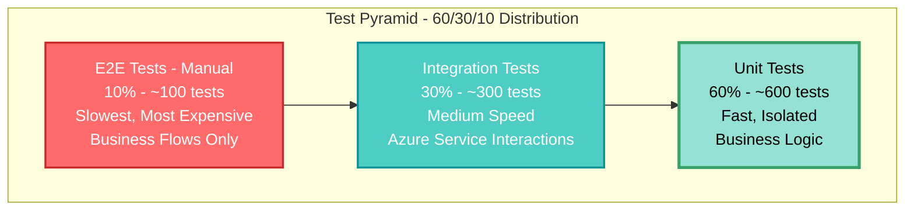
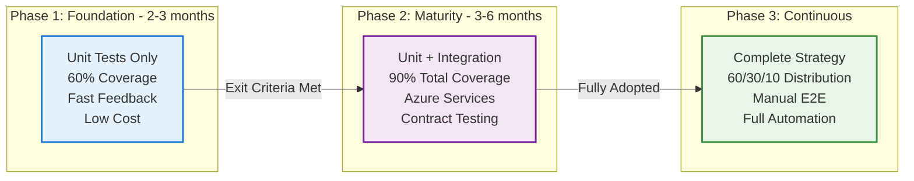
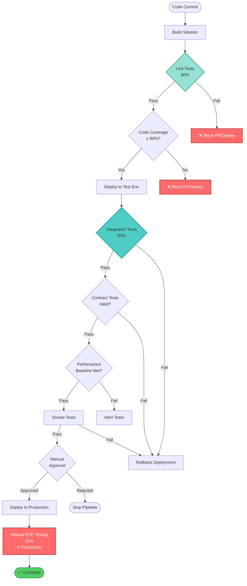
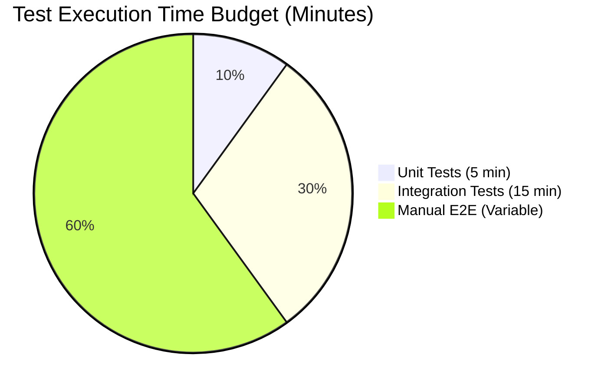
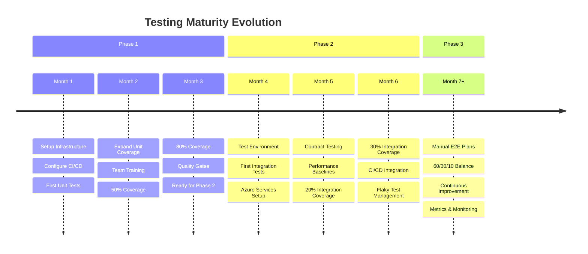
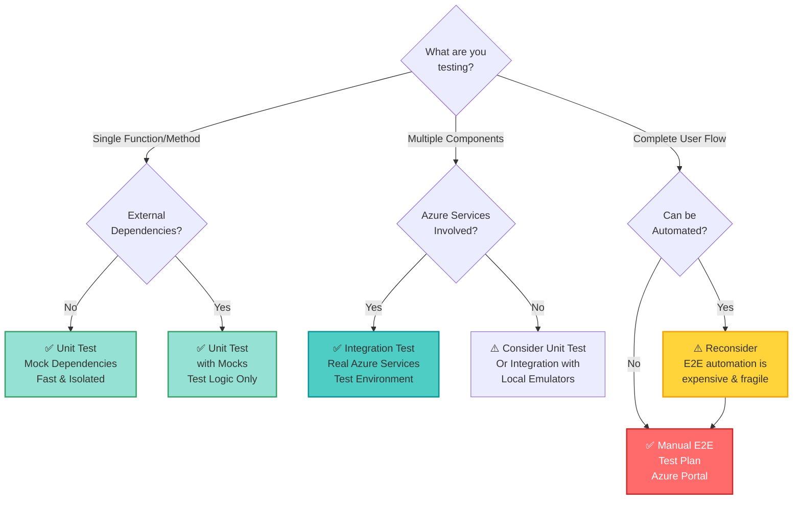

# Testing Strategy Visual Guides

This document provides visual representations of our testing strategy, architecture, and implementation patterns.

## Table of Contents
1. [Test Pyramid Architecture](#test-pyramid-architecture)
2. [Testing Strategy by Phase](#testing-strategy-by-phase)
3. [CI/CD Pipeline Flow](#cicd-pipeline-flow)
4. [Azure Service Testing Strategy](#azure-service-testing-strategy)
5. [Test Execution Time Distribution](#test-execution-time-distribution)
6. [Testing Maturity Journey](#testing-maturity-journey)
7. [Test Type Decision Tree](#test-type-decision-tree)

---

## Test Pyramid Architecture

The foundational principle: **60% Unit - 30% Integration - 10% E2E (Manual)**

**Key Principles:**
- **Unit Tests (60%):** Foundation - fast, cheap, high coverage
- **Integration Tests (30%):** Confidence - realistic, Azure services
- **E2E Tests (10%):** Strategic - manual, critical flows only

---

## Testing Strategy by Phase

Our incremental adoption approach across three phases:

---

## CI/CD Pipeline Flow

Complete pipeline with quality gates at each level:

---

## Azure Service Testing Strategy

Testing approach for key Azure services:

```mermaid
graph TB
    subgraph Azure Functions
    AF_UNIT[Unit Tests 60%<br/>- Business Logic<br/>- Validators<br/>- Transformers<br/>- Mocked Triggers]
    AF_INT[Integration Tests 30%<br/>- Real Triggers<br/>- Bindings<br/>- DI Container<br/>- Service Bus]
    AF_E2E[Manual E2E 10%<br/>- Azure Portal<br/>- End-to-End Flow<br/>- Production-like]
    end
    
    subgraph Logic Apps
    LA_UNIT[Unit Tests 60%<br/>- Inline Code<br/>- Expressions<br/>- Custom Connectors]
    LA_INT[Integration Tests 30%<br/>- Workflow Execution<br/>- Built-in Connectors<br/>- Managed Connectors]
    LA_E2E[Manual E2E 10%<br/>- Designer Testing<br/>- Run History<br/>- Monitoring]
    end
    
    subgraph Service Bus
    SB_UNIT[Unit Tests 60%<br/>- Message Handlers<br/>- Serialization<br/>- Validation]
    SB_INT[Integration Tests 30%<br/>- Queue Operations<br/>- Topics/Subscriptions<br/>- Dead Letter<br/>- Sessions]
    SB_E2E[Manual E2E 10%<br/>- Message Flow<br/>- Ordering<br/>- Transactions]
    end
    
    AF_UNIT -.->|Foundation| AF_INT
    AF_INT -.->|Confidence| AF_E2E
    
    LA_UNIT -.->|Foundation| LA_INT
    LA_INT -.->|Confidence| LA_E2E
    
    SB_UNIT -.->|Foundation| SB_INT
    SB_INT -.->|Confidence| SB_E2E
    
    style AF_UNIT fill:#95e1d3,stroke:#38a169,stroke-width:2px
    style LA_UNIT fill:#95e1d3,stroke:#38a169,stroke-width:2px
    style SB_UNIT fill:#95e1d3,stroke:#38a169,stroke-width:2px
    
    style AF_INT fill:#4ecdc4,stroke:#0a9396,stroke-width:2px
    style LA_INT fill:#4ecdc4,stroke:#0a9396,stroke-width:2px
    style SB_INT fill:#4ecdc4,stroke:#0a9396,stroke-width:2px
    
    style AF_E2E fill:#ff6b6b,stroke:#c92a2a,stroke-width:2px,color:#fff
    style LA_E2E fill:#ff6b6b,stroke:#c92a2a,stroke-width:2px,color:#fff
    style SB_E2E fill:#ff6b6b,stroke:#c92a2a,stroke-width:2px,color:#fff
```

---

## Test Execution Time Distribution

Pipeline execution time allocation:

**Total Automated Pipeline Time:** ~20 minutes  
**Manual E2E Time:** Variable (performed outside pipeline)

---

## Testing Maturity Journey

Timeline for achieving full testing maturity:

---

## Test Type Decision Tree

Decision guide for choosing the right test type:

---

## Quick Reference

### Color Legend
- 🟢 **Green (Unit Tests):** Fast, Isolated, Foundation
- 🔵 **Blue (Integration Tests):** Realistic, Azure Services, Confidence
- 🔴 **Red (E2E Tests):** Manual, Strategic, Critical Flows

### Key Metrics
| Metric | Target | Status Indicator |
|--------|--------|-----------------|
| Unit Test Coverage | ≥ 80% | 🟢 Good, 🟡 Warning < 70%, 🔴 Critical < 60% |
| Unit Test Distribution | 55-70% | 🟢 Compliant with 60% ± 10% |
| Integration Test Distribution | 25-35% | 🟢 Compliant with 30% ± 5% |
| E2E Test Distribution | 5-15% | 🟢 Compliant with 10% ± 5% |
| Unit Test Execution Time | < 5 min | 🟢 Fast, 🟡 Warning > 5 min |
| Integration Test Execution Time | < 15 min | 🟢 Acceptable, 🟡 Warning > 15 min |
| Flaky Test Rate | < 5% | 🟢 Stable, 🔴 Action Required > 10% |

---

## Usage

These diagrams are embedded in the [AUTOMATION_TESTING_STANDARD.md](AUTOMATION_TESTING_STANDARD.md) document. Use this file as a quick visual reference when:

- Explaining the testing strategy to new team members
- Making decisions about test types
- Planning test distribution for new features
- Setting up CI/CD pipelines
- Assessing project testing maturity

For complete details, refer to the main [AUTOMATION_TESTING_STANDARD.md](AUTOMATION_TESTING_STANDARD.md) document.

---

**Version:** 1.0.0  
**Last Updated:** February 9, 2026  
**Maintained by:** Architecture & Test Leads
